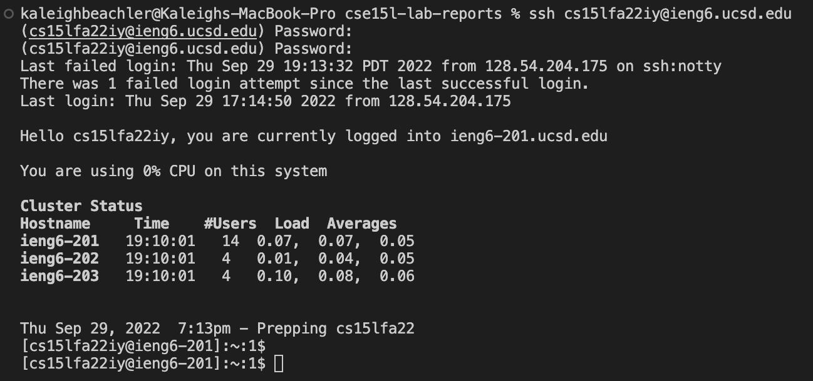

# Week 1 Lab Report
## Remote Access and the FileSystem Tutorial

I will be covering how to log into a course-specific account on "ieng6"!
 
 

## Part 1: Installing VScode
 

Click on [VScode](https://code.visualstudio.com/) to visit the website for visual studio code. The webpage should look something like this:

 Note that installation will be different depending on the OS.  OSX is for Macs and Windows is for PCs. 

 Click on the blue "Download" button to install VScode onto your computer.

 

After VScode is done installing, open up the application.  You should see a page like the following:

 

## Part 2: Remotely Connecting

 

Now that VScode is installed, we can begin remotely connecting to our server! :)

Windows users need to install a program called OpenSSH.  Mac users, like myself, do not need to take this step. The image below includes a guide to install OpenSSH using the GUI. 

For a more comprehensive tutorial, use [this link](https://learn.microsoft.com/en-us/windows-server/administration/openssh/openssh_install_firstuse?tabs=gui) to access instructions on how to install OpenSSH on your Windows system.

 

Now, we can begin the process of getting remote access to the server.

We need to open a terminal on VScode. In the bar on the top left of your screen, select "Terminal", and then select "New Terminal" in the drop down.

Type this command into your terminal:

`$ ssh cs15lfa22iy@ieng6.ucsd.edu`

If prompted with the question "Are you sure you want to continue connecting", type in "yes". Then, enter your password. A successful login should look like the image below. 

 

## Part 3: Trying Some Commands

 

Several useful commands are listed below:

`cd ~` 

`cd`

`ls -lat`

`ls -a`

`cp`

`cat`

Here are some outputs of commands run in the remote computer. 

Notice that "exit" is used to logout of the remote computer and return to your local one. 

 

## Part 4: Moving Files over SSH with scp

 

Now, we will send a copy of a file from your computer to a remote one. I will be using the file "WhereAmI.java" to demonstrate. 

Run and computer WhereAmI with the following commands:

`javac WhereAmI.java`

`java WhereAmI`

This screenshot shows the output of the above commands.

Now I will send this file to the remote computer using scp. 

`scp WhereAmI.java cs15lfa22iy@ieng6.ucsd.edu:~/`

The above shows what you should see after running the command. Now you can log into the remote computer, compile WhereAmI.java and run it.  Note that copying over a file will override a previously existing file with the same name. 

 

## Part 5: SSH Keys

 

SSH keys make it so you do not have to type in your password every time you log into the remote computer.

Use the following to set up ssh-keygen. 

The following image shows the running of the commands (excluding the fingerprint, where a white bar appears instead).

Now, navigate to the server and type these commands:

`$ mkdir .ssh`

`$ exit`

Back on the client, use these commands:

`scp /Users/kaleighbeachler/id_rsa.pub cs15fa22iy@ieng6.ucsd.edu:/~/.ssh/authorized_keys`

 

## Step 6: Optimizing Remote Running

 

You can directly run a command on a remote server.  The following command is an example:

`$ ssh cs15lfa22iy@ieng6.ucsd.edu "ls"`

You can also use multiple semicolons to run multiple commands on the same line.

`$ cp WhereAmI.java Other.Main.java; javac OtherMain.java; java WhereAmI`

You can also use "^" to recall the last command that was run. 
