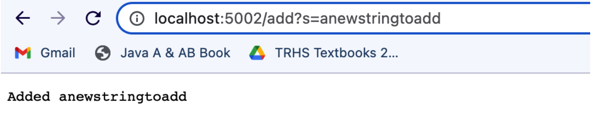
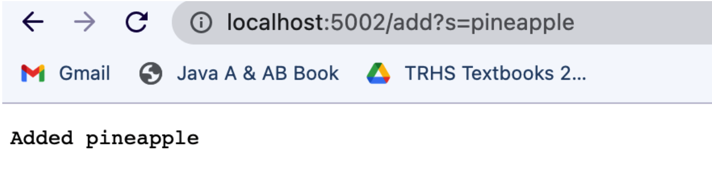
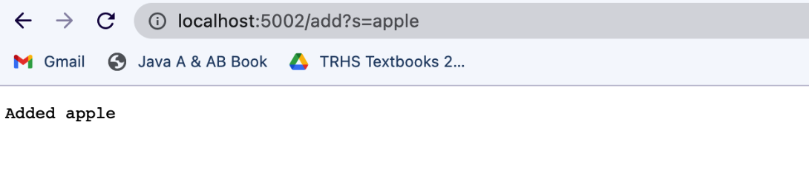
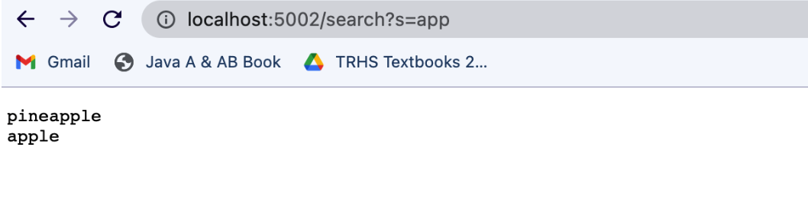

# Week 3 Lab Report

## Part 1: Search Engine

```
import java.io.IOException;
import java.net.URI;
import java.util.List;
import java.util.ArrayList;
 
class Handler implements URLHandler {
   // The one bit of state on the server: a number that will be manipulated by
   // various requests.
   ArrayList<String> strs = new ArrayList<>();
 
   public String handleRequest(URI url) {
           if (url.getPath().contains("/add")) {
               String[] parameters = url.getQuery().split("=");
               if (parameters[0].equals("s")){
                   strs.add(parameters[1]);
                   return String.format("Added " + parameters[1]);
               }
           }
           else if (url.getPath().contains("/search")){
               String[] parameters = url.getQuery().split("=");
               int count = 0;
               String temp = parameters[1];
               String ans = "";
               for (String s : strs){
                   if (s.contains(temp)){
                       ans = ans + s + "\n";
                       }
                   }
               return String.format(ans);
               }
           return "404 Not Found!";
           }
 
 
   class SearchEngine {
       public static void main(String[] args) throws IOException {
           if(args.length == 0){
               System.out.println("Missing port number! Try any number between 1024 to 49151");
               return;
               }
 
           int port = Integer.parseInt(args[0]);
 
           Server.start(port, new Handler());
       }
   }
 
}
```

The above code shows the implementation of my simple Search Engine. It uses and ArrayList of Strings to store the any String that is input after "/add". It is also retrieves Strings that contain another String, using the path "/search".

<br>
<br>

Now, I will show examples testing the website.

In the above screenshot, I have used "/add" to add "anewstringtoadd" to the ArrayList in SearchEngine. The "handleRequest" method is called, and it takes the URL as a parameter.  In this method, the path is accessed and checked using .getPath() and .contains().  The method recognizes the path "/add" and executes the first if statement, where a "anewstringtoadd" gets added to the ArrayList called "strs" which is a field for the class.  


At this point, the contents of "strs" include one value: "anewstringtoadd". 

<br>
<br>

Through the same process described above, I will add two more values to the ArrayList "strs". 



Now, the contents of "strs" are "anewstringtoadd" at index 0, "pineapple" at index 1, and "apple" at index 2. 

<br>
<br>

This SearchEngine also allows for Strings that contain a certain String to be returned. 

<br>
Let's say I use the following url:

```localhost:5002/search?s=app```

Now, the path is different. The handleRequest method will still execute, but the first if statement will not because "/add" is not in the path.  Since, "/search" is in the path, the else-if part of the method will execute. The ArrayList "strs" is traversed and each element is checked for containing the String "app". If the element does contain "app", it is added to the "ans" String along with a new line. This allows for a properly formatted output to be returned after the loop is done.  The contents of "strs" have NOT been altered.  However, all of the elements of "strs" containing "app" will be printed. We can see this in the screenshot below. 


<br>
<br>

## Part 2: Debugging!

I have a file called ArrayExamples.java which contains the following method:

```
static void reverseInPlace(int[] arr) {
    for(int i = 0; i < arr.length; i += 1){
      arr[i] = arr[arr.length - i - 1];
    }
```

This method is EXPECTED to take an array and reverse the order of the elements.  It is also expected to return the SAME array that was taken as an input. (This means it should NOT return a new array!). 

Take a look at the following test. 


Given the current definition of "reverseInPlace", it produces the following output. 


***Note that there are other tests running that are not shown, ignore those for now. We can focus on the failure of "testRevInPlace()". 

This output is a "symptom" of a bug we have inthe "reverseInPlace" method.  Why did this test fail? Let's trace through the test. First, arr[0] is set to the current value at arr[1].  So now, our array is {2, 2}. In the next (and last) interation, arr[1] is set to the current value at arr[0]. But wait- the current value at arr[0] is 2! Our 4 is gone because it has already been replaced. 

There are a number of ways to fix this problem. The way I fixed it is by making a new array and traversing the initial array backwards, updating each element of the new array starting from the front.  But you have to be careful with this implentation! You don't want to return a NEW array, but rather reverse the original. So, I used a for loop to update each element in the original array using the new array.  A screenshot of the code is below. 


Let's run this code to make sure it works!

Success!

<br>
<br>

Let's take a look at another example.  

In a file called LinkedListExample.java, we have a method called "append".
```
public void append(int value) {
        if(this.root == null) {
            this.root = new Node(value, null);
            return;
        }
        // If it's just one element, add if after that one
        Node n = this.root;
        if(n.next == null) {
            n.next = new Node(value, null);
            return;
        }
        /*
        Otherwise, loop until the end and add at the end with a null
        */
        while(n.next != null) {
            n = n.next;
            n.next = new Node(value, null);
        }
    }
 ```

 
 This method is EXPECTED to take a value and add it to the end of the LinkedList (via updating the next reference of the current last element in the LinkedList and setting the next reference of the NEW last element to null). 

I ran the following test on this method. 


And it produced this output: 

After waiting for a while, I noticed that the code would not finish running, which is a symptom of the program. 

Why won't the test finish running? This usually has something to do with loops running indefinitely. Taking a look at the original code, you'll notice that in the while loop, n.next is continuously set to the new value. The condition for the loop is (n.next!=null), and we can see that n.next will NEVER equal null because the next value is continuously updated to the new value! We can easily fix this problem by moving the line "n.next=new Node(value, null);" to the outside of the loop. 


This is our new code, and this is the output the test produces: 


The new code works! This is because the loop executes until a Node is reached with a .next that equals null, indicating where the last element is.  Then after the loop is complete, we can set n.next to the new Node and successfully append it to the end of the LinkedList! 